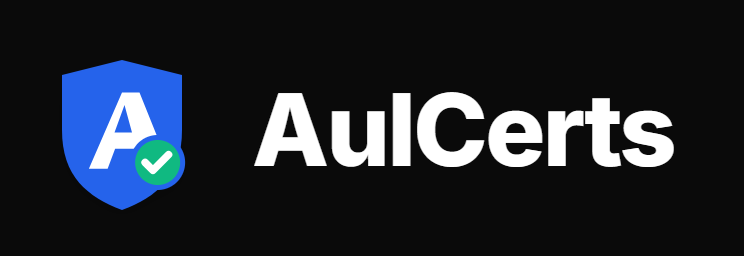

## What is AulCerts? ##

This SaaS / Website is basically a google search scrapping tool (using a gemini api key) that gathers free certification material for IT Certifications.
The purpose of this tool is to allow users to be able to find free information and track those websites/videos to help them study.
This is a freeium service that has a pro membership allowing you some features like but currently limited to: Tracking unlimited Certs, more ai bandwith for the ai chat bot, exporting markdown files including the cert info that you're tracking.
The reason why i include a premium version is due to the free portion using my own api key (this could cost me a lot depening on how many people use it). 

## List of features wanting to add in the future (Free and Paid):

### Free Membership Ideas (Focus: Lead Generation & Utility) ###

Curated Starter Roadmaps: Instead of just a search bar, offer pre-built, interactive checklists for the most common entry-level certs (like CompTIA A+ or Security+).

Resource Upvoting (Reddit-style): Allow free users to click an "upvote" button on the links the AI finds. Over time, your database will naturally bubble the absolute best, community-verified free resources to the top.

Basic Progress Bar: A simple visual tracker where they can check off topics they've studied.

### Pro Membership Ideas (Focus: Time-Saving & Automation) ###

Dynamic Study Calendars: For heavy-hitter exams like the CCNA or CompTIA Cloud+, offer an interactive, day-by-day calendar. If a user misses a day of studying, the calendar automatically recalculates and shifts their schedule to keep them on track for their test date.

Discord Bot Integration: A private Discord bot that Pro members can invite to their server. It could ping them daily with a customized practice question or a reminder to review a specific module.

AI Practice Exam Generator: Instead of just searching for links, the AI generates a customized 10-question multiple-choice quiz based on the specific exam domain the user is currently studying.

Gamified Milestones: Turn studying into a satisfying grind, similar to leveling up or gathering resources in games like Minecraft. As they log study hours or pass practice quizzes, they unlock badges or visual shield upgrades on their dashboard.

## 3rd party applications used ##

Nodejs version: 15.5.12

Vercel (deployment for site/nodejs/prisma(postgreSQL))

Stripe (external payment link and customer mgmt)

Clerk (oauth for credentials and linked to prisma database) 

Google Gemini (gemini-3-flash-preview model for ai chat bot & search engine scraper)

Barrion.io (Used for website security assessment report)

## Other Projects / Links ##
### [Network CLI Training Website](https://www.learnaul.com/) ###
### [Portfolio](https://anthonyaul.com/) ###
### [Linkedin](https://www.linkedin.com/in/anthony-m-aul/) ###
